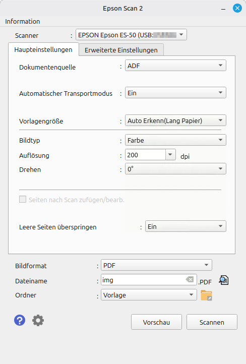
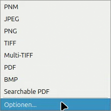
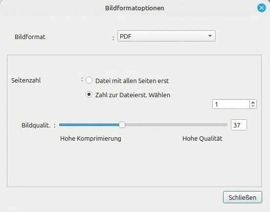
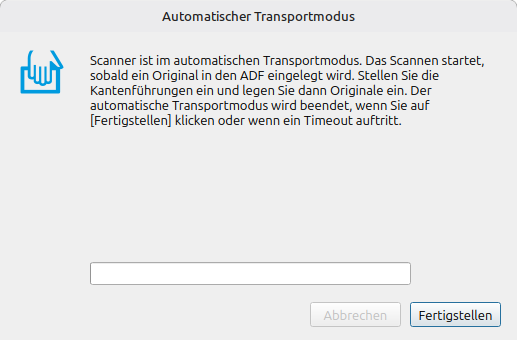

Hier findet ihr alle wichtigen Infos rund um den neuen Epson Scanner. Sowohl wie ihr **installiert**, falls noch nicht geschehen, als auch was für **Einstellungen** empfohlen werden, damit das **Scannen** aller Quittungen so schnell und effizient wie möglich läuft.

## Installation

Dieses Handbuch führt dich durch die Installation der Treiber für unsere neuen Quittungs-Scanner unter Linux. 
Folge einfach den Schritten.

!!! warning "Vorbereitung"
    Stelle sicher, dass du als **Administrator** angemeldet bist und das **Administrator-Passwort** zur Hand hast. 
    Du wirst es im Verlauf der Installation ggf. noch einmal benötigen.

<h3>1. Software herunterladen</h3>

1. Öffne deinen Browser und gehe auf das [Epson Download Center](https://download-center.epson.com/softwares/?device_id=ES-50&region=DE&os=DEBX64&language=de).
    - Prüfe, dass als Betriebssystem **Linux Deb(x64)** ausgewählt ist.
    - Als Land/Region sollte **Deutschland** ausgewählt sein.

2. Suche in der Tabelle nach der Zeile **Epson Scan2**.
3. Klicke in dieser Zeile auf **WEITER ZUM DOWNLOAD**.

4. Auf der neuen Seite erscheint die **SOFTWARE-LIZENZVEREINBARUNG**.
    - Bestätige: **Ich stimme der Softwarelizensvereinbarung zu.**

5. Klicke unten rechts auf den nun blauen Button **HERUNTERLADEN**.

6. Die Datei wird heruntergeladen. Sie befindet sich später in deinem `Downloads`-Ordner.
   
    ??? info "Dateiname"
        Die Datei sollte ähnlich heißen: `epsonscan2-bundle-6.7.90.0.x86_64.deb.tar.gz`  
        *(Die Zahlen können variieren. Wichtig ist die Endung `.tar.gz`.)*

<h3>2. Datei entpacken</h3>

1. Öffne den Ordner **Downloads**.
2. Mache einen **Rechtsklick** auf die heruntergeladene Datei.
3. Wähle im Kontextmenü **Hier entpacken** (meistens die zweite Option von unten).

    !!! note "Ergebnis"
        Es wird ein neuer Ordner erstellt, der denselben Namen hat, jedoch **ohne** die Endung `.tar.gz`.

4. Öffne diesen neuen Ordner per Doppelklick.

<h3>3. Installation ausführen</h3>

1. Suche im Ordner die Datei `install.sh`.
2. Mache einen **Doppelklick** auf die Datei.

3. Es erscheint ein Fenster mit der Frage, wie die Datei ausgeführt werden soll.
    - Klicke links auf **Im Terminal ausführen**.

4. Es öffnet sich ein schwarzes Terminal-Fenster.
    - Du wirst nach dem **Administrator-Passwort** gefragt.
    - Gib das Passwort ein und drücke **Enter**.

    !!! danger "Wichtig beim Passwort eingeben"
        Unter Linux kann es sein, dass du **keine Sternchen (*) oder Punkte** siehst, wenn du das Passwort tippst.  
        Das ist normal! Einfach blind tippen und Enter drücken.

5. Warte, bis die Installation abgeschlossen ist.

!!! Warning
    Das Terminal schließt sich automatisch, sobald der Prozess abgeschlossen ist.

<h3>4. Aufräumen</h3>

Die Installation ist erfolgreich abgeschlossen. Du kannst nun die Installationsdateien löschen, um Platz zu sparen:

1. Gehe zurück in deinen `Downloads`-Ordner.
2. Lösche die ursprüngliche `.tar.gz` Datei.
3. Lösche den entpackten Ordner.

Der Epson Scan2 ist nun installiert und einsatzbereit. 🎉

---

## Empfohlene Einstellungen
Für die aus unserer Sicht effizienteste Nutzung empfehlen wir folgende Einstellungen zu übernehmen, wobei **Automatischer Transportmodus** und **Bildformat** die wichtigsten Einstellungen sind, für die es sich lohnt, noch einmal genauer in die entsprechende Erklärung zu schauen.

!!! info
    Es empfielt sich sicherzustellen, dass man als Mitarbeiter am Gerät angemeldet ist, bevor man die Einstellung vornimmt, da die Einstellungen nur für das Nutzerprofil gespeichert werden, mit dem man angemeldet ist.

<h3>Anmerkung und Erklärung</h3>

<h4>Dokumentenquelle</h4>
**ADF** (steht für **Automatic Document Feeder**, also **automatischer Dokumenteneinzug**) ist speziell dann nötig, wenn der Automatische Transportmodus aktiviert ist, da der Scanner dann beim Einschieben eines neuen Originals dieses automatisch erkennt und den Scannvorgang startet.

<h4>Automatischer Transportmodus</h4>
Empfehlen wir auf **Ein** zu stellen, da es ermöglicht, den Scan-Prozess einmal manuell zu starten und dann mittels **ADF** ohne Unterbrechung alle Originale am Stück scannen zu können.

<h4>Vorlagengröße</h4>
Kann nach Präferierung angepasst werden. Jedoch haben wir im Test festgestellt, dass auch **Automatische Erkennung** nicht ausreicht, um lange Quittungen am Stück einscannen zu können. Der einzige Modus, in dem wir bei unseren Tests beliebig lange Quittungen problemlos einscannen konnten, war **Auto Erkenn(Lang Papier)**.

<h4>Auflösung</h4>
Wir empfehlen **200 DPI**, weil das Verhältnis zwischen **Geschwindigkeit** und **Qualität** am besten ist. Solltet ihr nach einem Scan festellen, dass das gescannte Dokument zu unscharf ist, empfehlen wir mit der Auflösung etwas höher zu gehen. Hierbei sei aber erwähnt, dass eine höhere Auflösung zu einer längeren Scandauer pro Dokument führt.

<h4>Bildformat</h4>
Grundsätzlich kann nach Belieben auch eine andere Einstellung gewählt werden. Nach dem Feedback, was uns erreicht hat, ist es jedoch lästig, eine einzelne PDF zu haben, in der alle Quittungen enhalten sind und diese dann nachträglich manuell trennen und einzeln abspeichern zu müssen. Genauso lästig ist es, für jede Quittung einen neuen Scann-Prozess starten zu müssen. Aus diesem Grund empfehlen wir folgende Einstellung, die es euch ermöglicht, alle Quittungen auf einmal fortlaufend einzuscannen und jede Quittung im Anschluss automatisch in einem eigenständigen PDF-Dokument zu speichern.

Klickt hierfür auf das Dropdown-Menu neben **Bildformat** (in dem PDF, PNG o.Ä. steht) und darin klickt ihr dann auf **Optionen**.(1)  
Anschließend öffnet sich ein Fenster mit dem Titel **Bildformatoptionen**. Wählt darin als Bildformat **PDF** aus, wechselt bei Seitenzahl von "Datei mit allen Seiten erst" auf "**Zahl zur Dateierst. Wählen**" und stellt sicher, dass darunter eine **1** in das Zahlenfeld eingetragen ist. Danach kann auf **Schließen** geklickt werden.(2)

1.  
2. 

??? question "Warum wird eine **1** eingetragen?"
    Diese eingetragene **1** legt fest, dass immer nach dem Scan von einer einzelnen Seite ein neues Dokument erstellt werden soll. Sollten also mal bei einem Scan immer zwei aufeinanderfolgende Seiten zu einem Dokument zusammengefügt werden, so muss diese Zahl nur auf **2** geändert werden.

<h4>Ordner</h4>
Hier sei nur zu erwähnen, dass hinter **Ordner** als Speicherort **Vorlage** steht. Hierbei handelt es sich jedoch um einen Anzeigefehler, denn tatsächlich handelt es sich hierbei um den **Dokumente** Ordner. Also muss das nur nach Belieben geändert werden, falls die gescannten Dokumente nicht im Dokumente Ordner landen sollen.

---

## Nutzung

1. **Epson Scan 2** starten(1)
2. **Einstellungen** prüfen (2)
3. **Scannen** Button klicken, um Scan-Prozess zu starten. (3)
4. Quittungen nacheinander durch Scanner laufen lassen.
5. Nach dem letzten Dokument, das gescannt wurde, kann auf Fertigstellen geklickt werden und der Scann-Vorgang ist abgeschlossen.

1. Falls das Gerät nicht gefunden wurde, die Verbindung kontrollieren und Aktualisieren.
2. Am besten die [empfohlenen Einstellungen](#empfohlene-einstellungen) übernehmen.
3. Wurde **Automatischer Transportmodus** aktiviert, öffnet sich ein neues Fenster:   
    Sobald die erste Seite eingescannt wurde, sollte über dem weißen Balken der Text **Scannen von Seite: 1** erscheinen. Mit jedem weiteren Scann sollte sich die Zahl weiter erhöhen.
