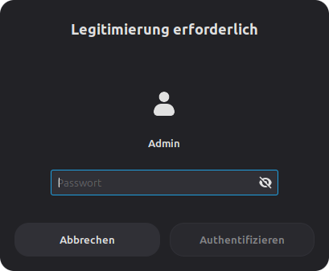
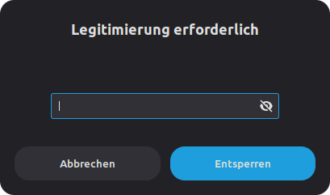

# Legitimierungsanfragen

## Warum fragt Linux nach meinem Passwort?

Wenn du unter Linux arbeitest, wirst du regelmäßig aufgefordert, dein Passwort einzugeben. Das kann verwirrend sein – besonders wenn die Anfragen unterschiedlich aussehen oder zu unterschiedlichen Zeitpunkten erscheinen.

Die gute Nachricht: **Das ist normal und ein wichtiger Sicherheitsmechanismus.** Linux schützt dich und das System damit vor unbeabsichtigten oder böswilligen Änderungen.

## Die 2 wichtigsten Arten von Legitimierungsanfragen

Linux fragt nach deinem Passwort aus unterschiedlichen Gründen. Hier sind die wichtigsten:

### 1. Admin-Legitimierung

**Wann?** Wenn du etwas am **gesamten System** änderst.

*mögliche Beispiele:*

- Software installieren oder aktualisieren
- Netzwerk-Einstellungen ändern
- Treiber installieren
- Andere Benutzer verwalten

**Erkennungszeichen:** Ein Fenster in dem speziell nach **Admin** gefragt wird.

**Was bedeutet das?** Das System prüft, ob du die Berechtigung hast, tiefe Änderungen am Computer vorzunehmen.

---

### 2. Schlüsselbund-Entsperrung

**Wann?** Wenn ein Programm **gespeicherte Passwörter oder Verschlüsselungsschlüssel** abrufen möchte.

*mögliche Beispiele:*

- Wire öffnet sich und will deine Nachrichten entschlüsseln
- Chromium möchte ein gespeichertes Passwort ausfüllen

**Erkennungszeichen:** Es wird **nicht** expliziet nach einem Nutzer gefragt und meistens steht im Text irgendwo das Wort „**Schlüsselbund**”.

**Was bedeutet das?** Deine sensiblen Daten (Tokens, Verschlüsselungsschlüssel) werden nicht im Klartext auf der Festplatte gespeichert, sondern in einem verschlüsselten Safe – dem **Schlüsselbund**. Dein Passwort ist der Schlüssel zu diesem Safe.

---

## Nächste Schritte

<!-- - **Du möchtest mehr über Admin-Legitimierung erfahren?** → [Admin-Legitimierung (Sudo)](./admin-legitimierung.md) -->
- **Fragen zum Schlüsselbund?** → [Schlüsselbund verstehen](./schlüsselbund.md)