# ISO-Erstellen

!!! Warning "Hinweis"

    Cubic funktioniert ausschließlich unter Debian und Ubuntu basierten Distributionen. 

## Cubic installieren
Terminal mit ++"STR"+"ALT"+t++ öffnen  
und folgendes eingeben:

``` sh
sudo apt-add-repository ppa:cubic-wizard/release
sudo apt update
sudo apt install cubic
```

## Projekt erstellen/auswählen
Die gewünschte Linux ISO von offizieller [Linux Mint](https://linuxmint.com/) Website downloaden.

Cubic durch öffnen über System-Suche starten oder via Terminal durch eingeben von `cubic`.

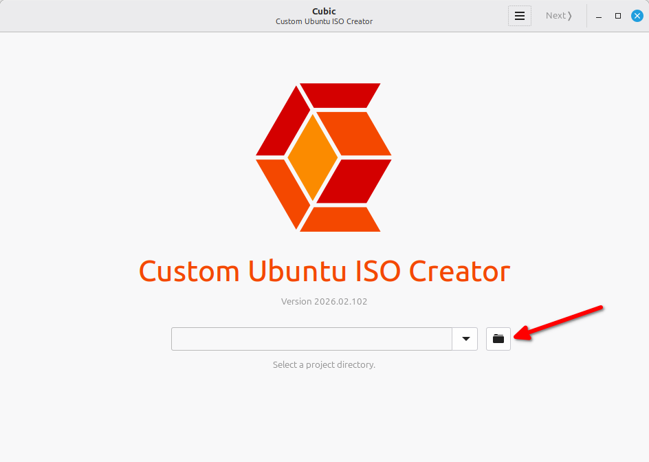  
Auf den Ordner-Button klicken.  
Falls schon ein Projekt-Ordner existiert kann dessen Pfad auch einfach eingetragen werden.

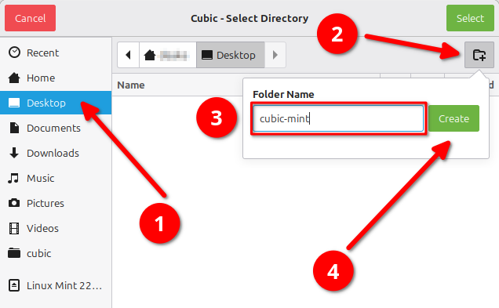  
Zuerst links auf `Desktop` klicken, als nächstes auf das `Ordner`-Symbol mit dem `+` klicken, nun noch einen Project-Namen eingeben und abschließend auf `Create` klicken.

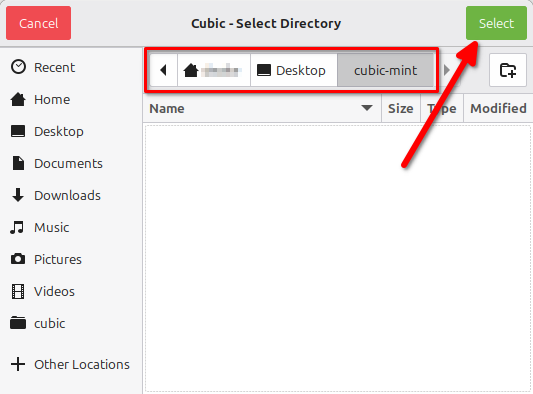  
In Projekt-Ordner (in diesem Fall `cubic-mint`) navigieren und dann oben rechts auf `Select` klicken.

## Cubic Oberfläche durchlaufen

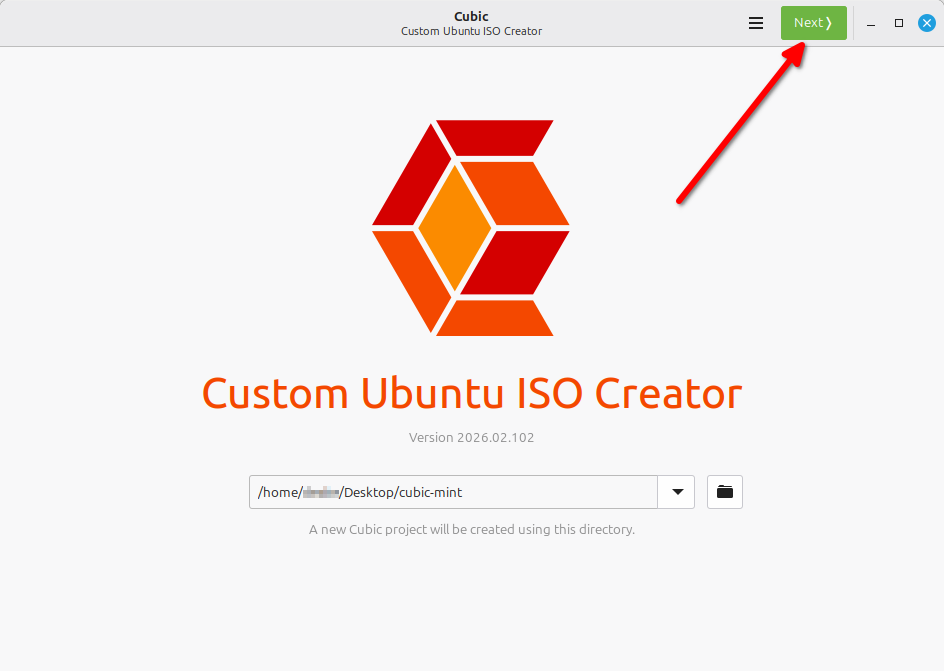  
Anschließend oben rechts auf `Next` klicken.

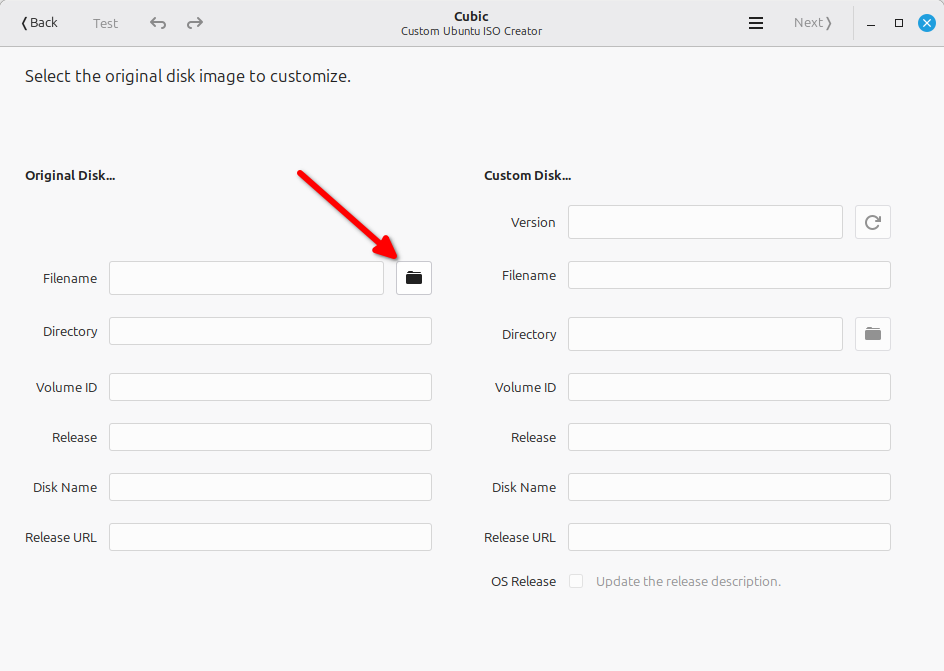  
Auf den Ordner-Button klicken.  
Sollte ein Projekt-Ordner ausgewählt worden sein, der schon einmal bearbeitet wurde, dann sind diese Informationen ggf. schon ausgefüllt und somit kann das Auswählen der ISO in diesem Fall einfach übersprungen werden.

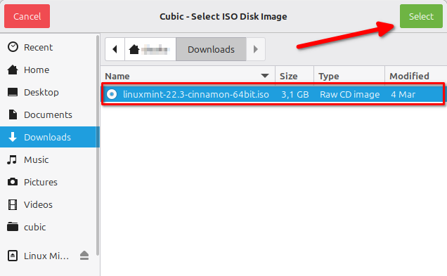  
Im `Downloads`-Ordner (oder an dem entsprechenden Ort wo sie hin gespeichert wurde) nach der ISO suchen, diese auswählen und oben rechts auf `Select` klicken.

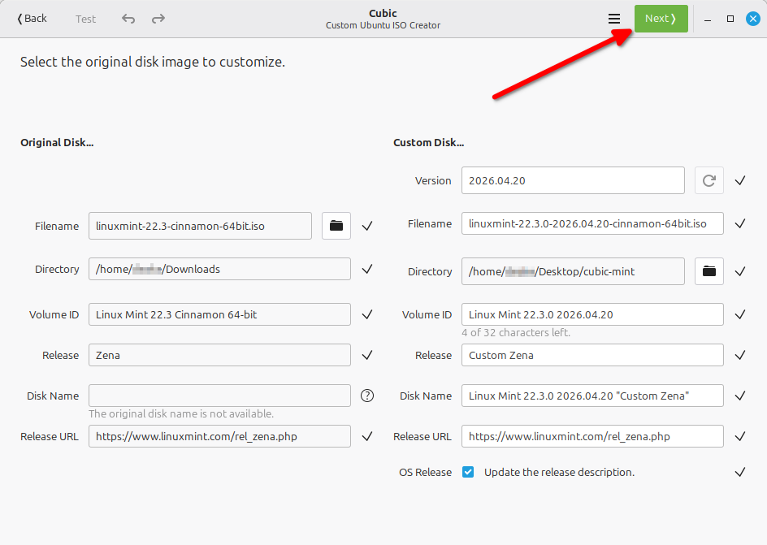  
Ggf. Informationen anpassen, ansonsten oben rechts auf `Next` klicken.

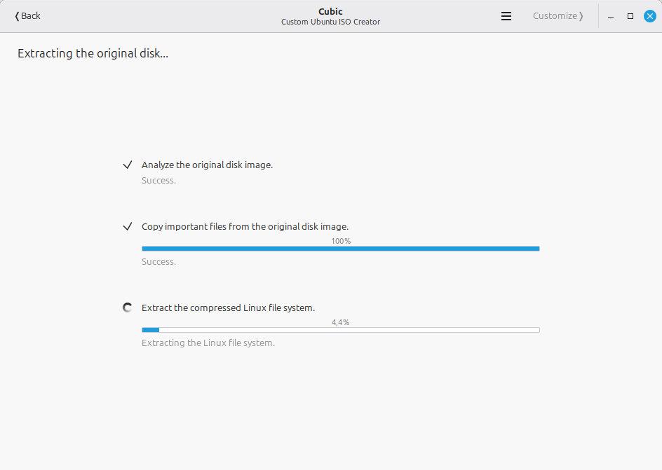  
Abwarten und nichts tun, springt automatisch weiter.

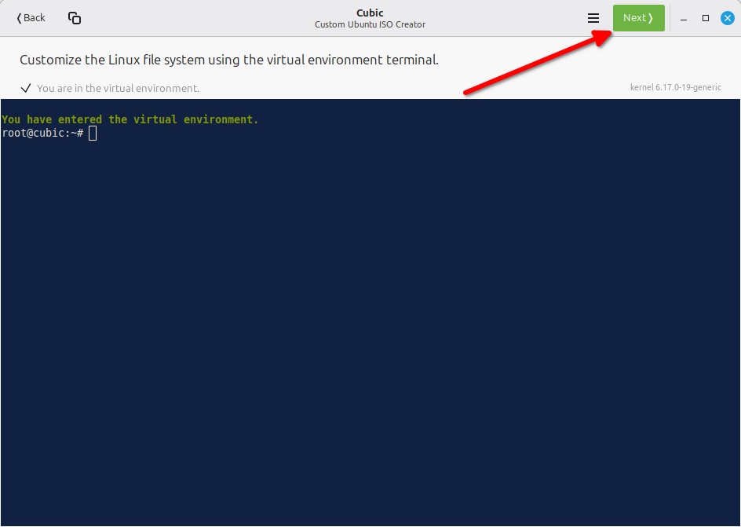  
Sobald es auftaucht alle gewünschten Änderungen vornehmen.

## Erstellung abschließen

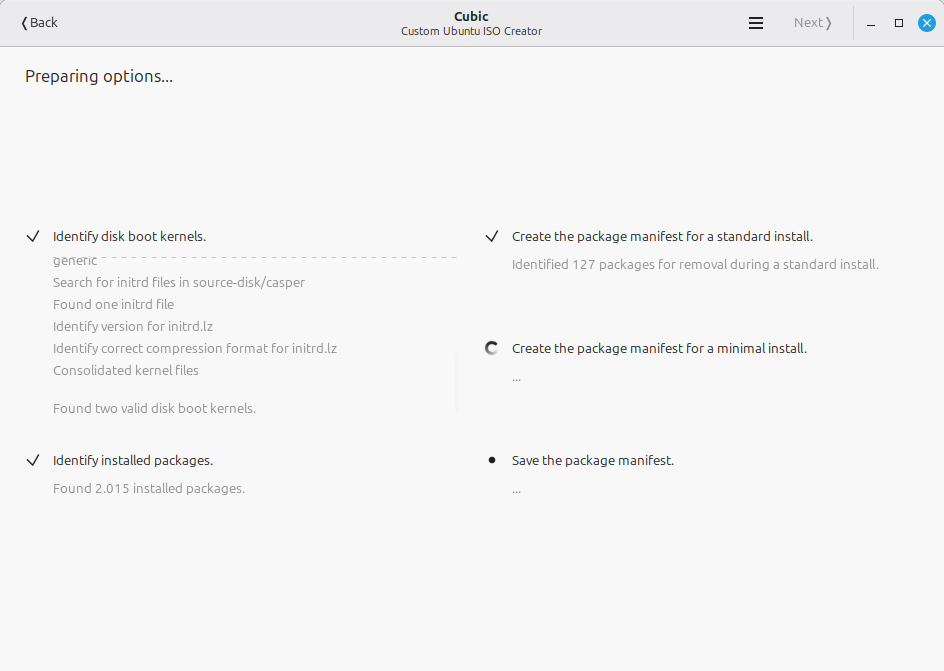  
Abwarten und nichts tun, springt automatisch weiter.

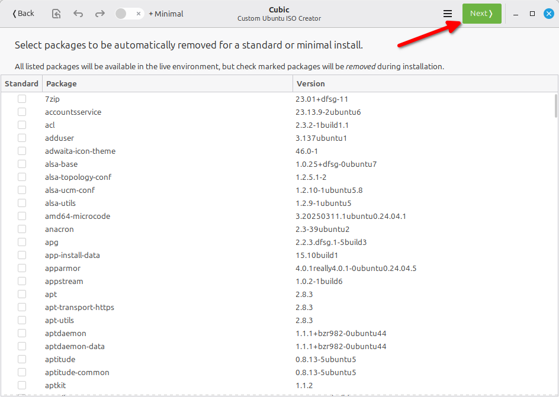  

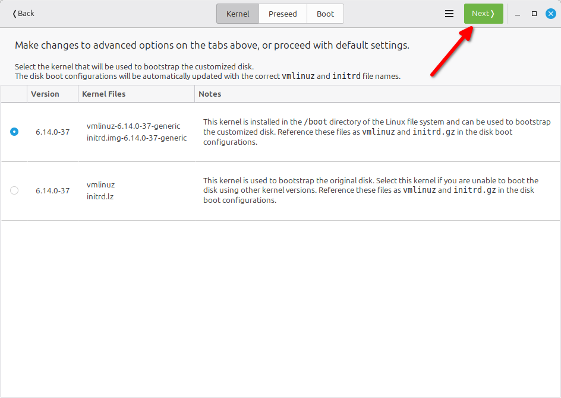

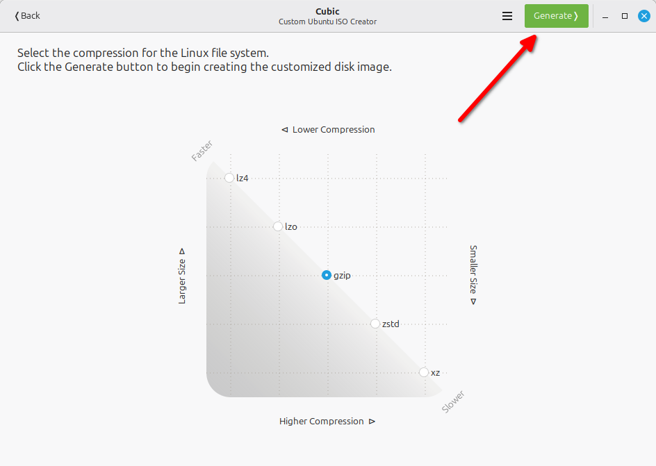

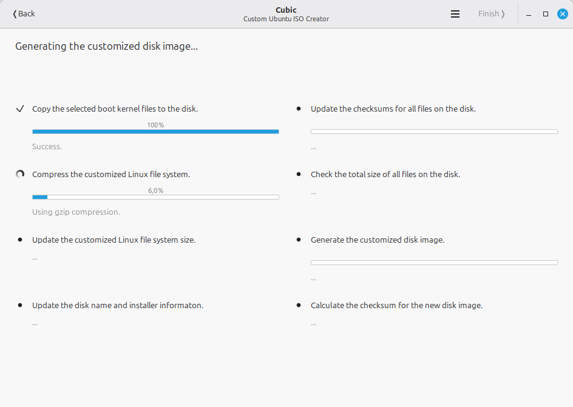  
Abwarten und nichts tun, springt automatisch weiter.

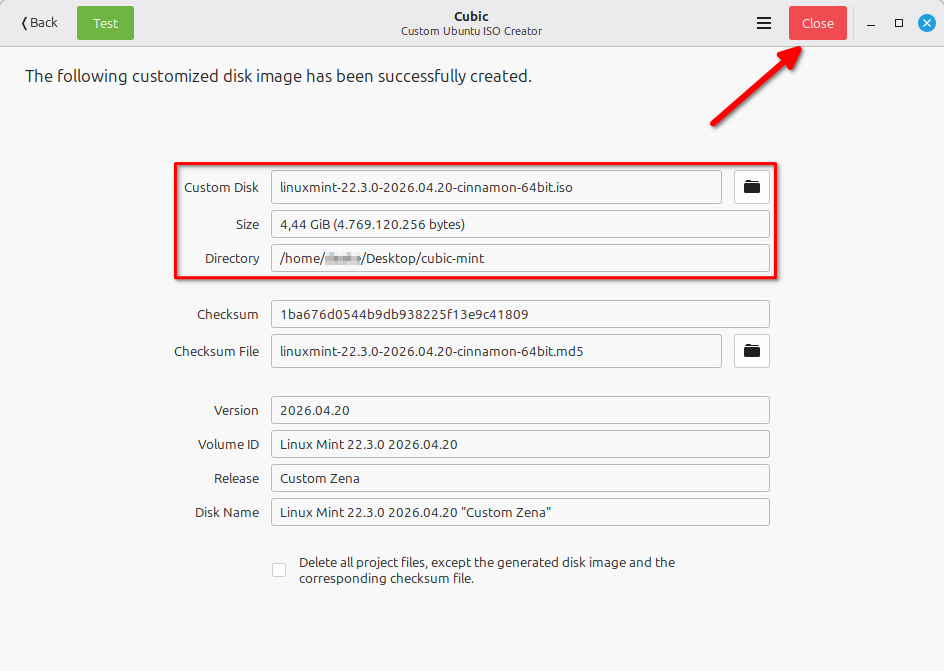  
Auf dieses Fenster warten.
