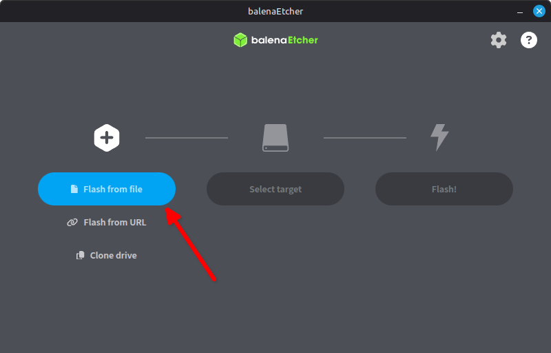
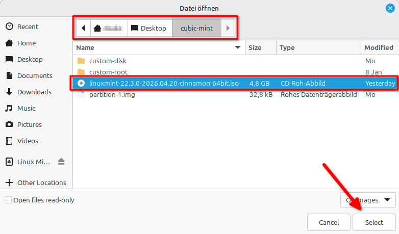
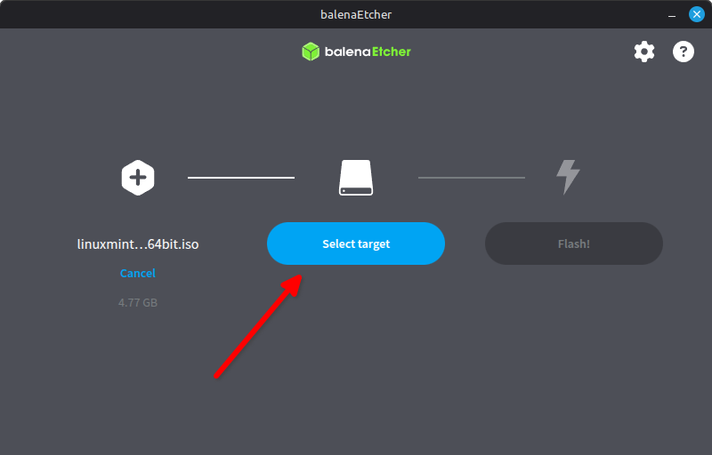
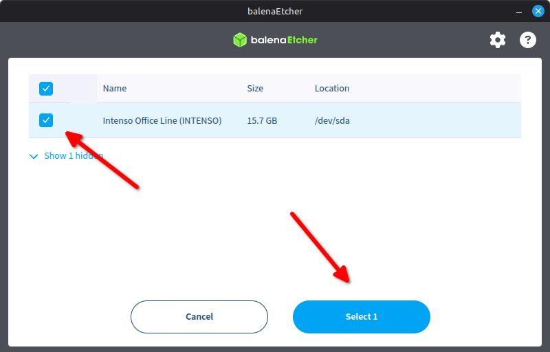
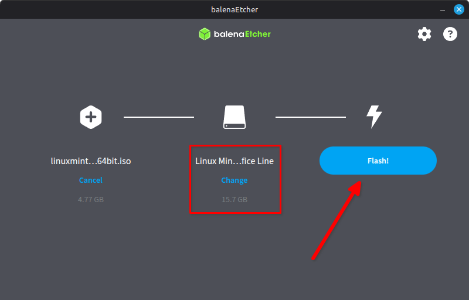
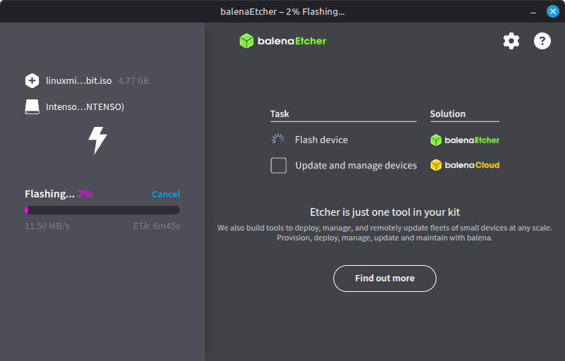
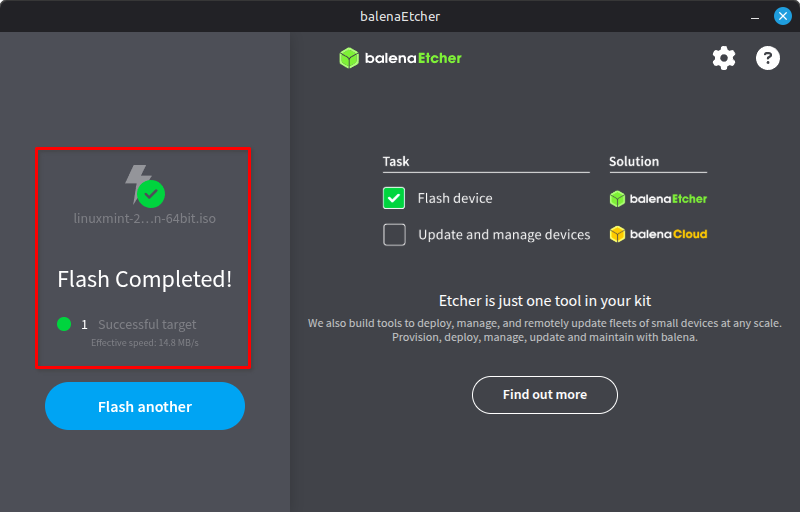

# Bootfähigen Stick erstellen

## Balena Etcher installieren

Debian Package (`.deb`) Von der offiziellen Github Seite die [neuste Version](https://github.com/balena-io/etcher/releases/) Downloaden

Im Terminal mit `sudo apt install ~/Downloads/balena-etcher_*` installieren.

Danach kann die Datei mit `sudo rm ~/Dowloads/balena-etcher_*` gelößcht werden.

## ISO auf Stick spielen

                                                                                                                                                                                       

